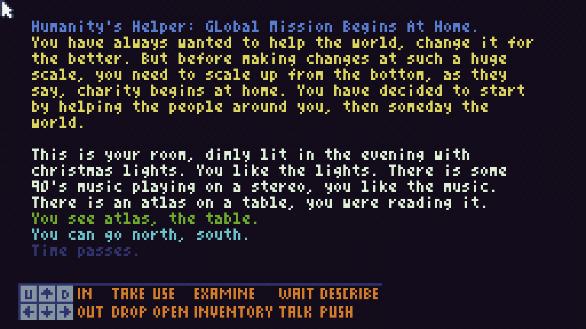
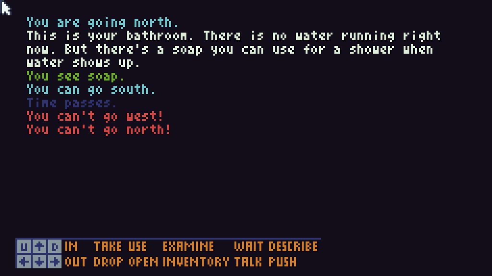

# Humanity's Helper
Game-Off 2023 TIC-80 GUI based parser game.

Ever wanted to help others, but didn't know what is the right way. We are not talking about effective altruism here, what if someone perhaps wanted a pen, but you gave them your pet frog instead.

<em>A ridiculous GUI based parser text adventure, where you are on a quest to help everyone in your neighbourhood with the best possible way you can, while preparing to take the train to go outside your town for the first time, to scale up your mission to help the world.</em>

This year's theme for the Github Game-Off Jam is 'scale'. To me it presented the idea of scaling up your ambitions.&nbsp;I needed to feel connected to the story somehow, to be able to finish it within the month while also having time to fix bugs and add features that playtesters suggest.&nbsp;I don't run a company or an economy, which were my immediate ideas for the theme,&nbsp;but I do have dreams of changing the world for the better, but how does anyone approach such a problem?

What I have learned over the years is to work from where you are, bring useful changes to your surroundings, have a more disciplined lifestyle. But for the purpose of a fun game that players and other gamedev's might enjoy for 15 to 30 minutes, I wanted to parody my own ideas.

<em>Inspired by my own neighbourhood where I grew up, I present to you Humanity's Helper.</em>

